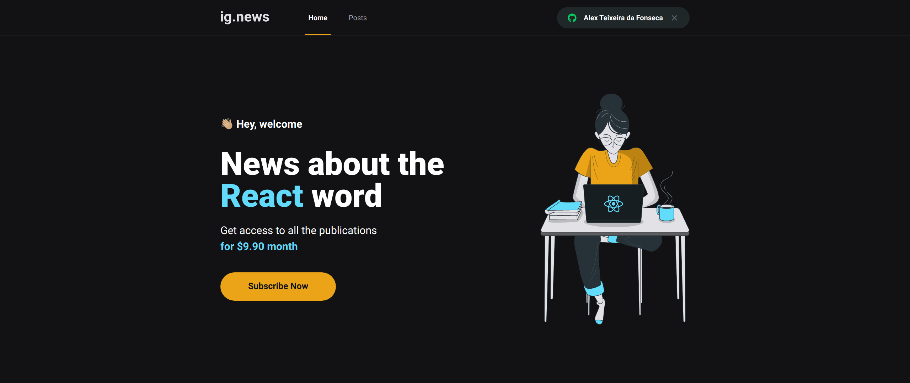

# Ig.news



> Ignews é uma aplicação de conteúdo sobre React.js com sistema de inscrição via stripe. Essa aplicação foi desenvolvida no treinamento do ignite da rocketseat, nele foi mostrado com criar uma aplicação JAMStack onde não precisamos de back-end para fazer o desenvolvimento da aplicação.

## 💻 Pré-requisitos

Antes de começar, verifique se você atendeu aos seguintes requisitos:

- Você instalou a versão mais recente do `< node / npm ou yarn >`
- Você tem uma máquina `< Windows / Linux / Mac >`.

## 🚀 Instalando o projeto na sua maquina

Para instalar o projeto, siga estas etapas:

Linux e macOS:

```bash
git clone https://github.com/alextfonseca/ignews.git

$ cd ignews

$ yarn install ou npm install

$ yarn start ou npm start
```

Windows:

```bash
git clone https://github.com/alextfonseca/ignews.git

$ cd ignews

$ yarn install ou npm install

$ yarn start ou npm start
```

## 🧾 Usando o projeto

Com o projeto Ig.news você teá um exemplo de como construir uma aplicação com CMS e como criar método de pagamento dentro do aplicação:

# <a href="https://github.com/alextfonseca/ignews">Acesse o projeto</a>

## 😄 Me siga nas redes sociais<br>

<p align="left">

  <a href="https://www.linkedin.com/in/alex-teixeira-da-fonseca-5a99931a2/" alt="Linkedin">
  </a>

  <a href="https://wa.me/+5511976184659?text=Olá%20Alex" alt="WhatsApp">
  </a>

  <a href="https://www.instagram.com/devalextf/?hl=pt-br" alt="Instagram">
  </a>
</p>
